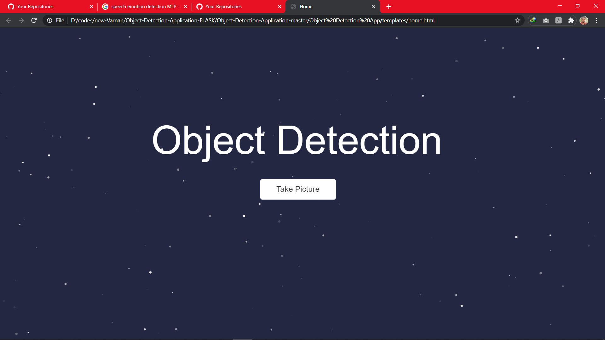

# ASTITVA - THE OBJECT DETECTOR

This Project is a web application built with the *python-flask* framework, that uses YOLO weights to detect the Objects.
Using YOLO object detection algorithm.And the main idea is to guide the physically challenged person with the harmful object around them.

